# Vears – e-shop (PHP + MySQL)

Demo - live version available at:
[**Vears – Live demo (cba.pl)**](https://vears.j.pl/)

A student engineering-degree project.
A desktop website — an online store offering clothing, footwear and accessories. Developed using PHP, JavaScript and SCSS. It includes custom-built, widely used mechanisms such as:
a carousel, slider, product search by keywords, a complete user profile, a shopping cart, a favourites list, and login/registration forms with validation, encryption and reCAPTCHA support. The project is connected to a database using MySQL queries. The database contains product data and user account information.

### Project Goals

- Develop a fully functional desktop-oriented e-commerce website (minimum width ≥ 992 px), implementing key components of shopping logic, excluding integration with external payment APIs.
- Implement commonly used UI mechanisms found in modern web applications, such as: accordion, slider/carousel, forms, product search engine, user panel, product page, and shopping cart.
- Provide effective and secure validation for both authentication forms (login and registration), covering front-end verification as well as backend data integrity.
- Create a relational MySQL database containing product information and user account data, with full support for reading and writing records.
- Maintain strict separation between data and presentation layers — all product-related information (image paths, prices, descriptions, technical parameters and other metadata) should be dynamically loaded from the database.
- Implement an advanced product search engine capable of handling arbitrary text input, searching across both product names and descriptions.
- Enable users to download files such as a complaint form template

### Technology Stack

- **PHP 8.4** - Backend application logic, user authentication, form handling, input validation, password encryption, and communication with the MySQL database.
- **MySQL** – Relational database storing product information, user accounts, and all associated metadata required for the functioning of the store.
- **HTML, CSS, SCSS** – Structure and styling of the user interface.
- **JavaScript (Vanilla JS)** – Front-end logic, dynamic UI components.
- **cba.pl** – Hosting environment for both the PHP application and the MySQL database; used for deployment, testing, and remote access to the production version of the project.

## Screenshots

;
;
;
;
;
;
;
;
;
;
;
;
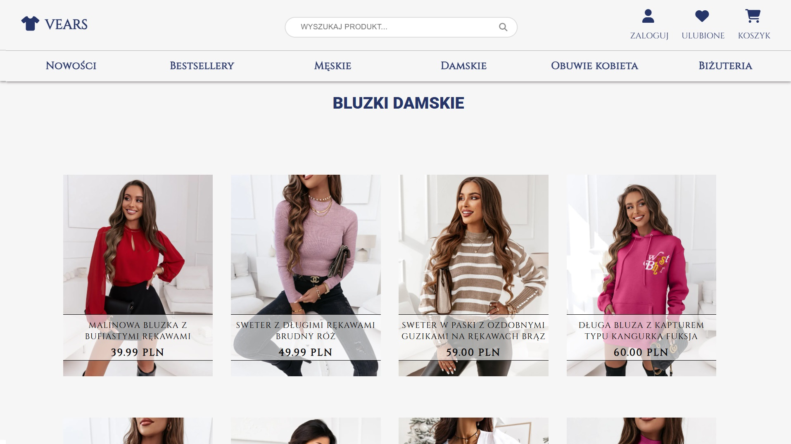;
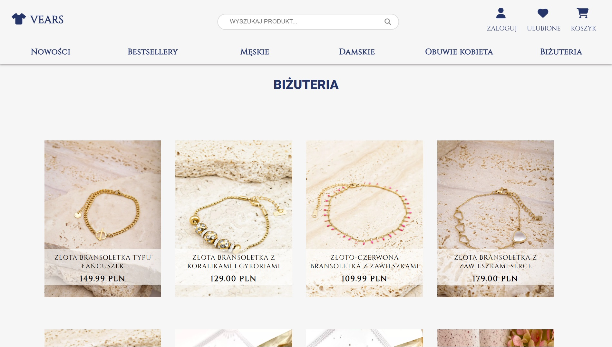;
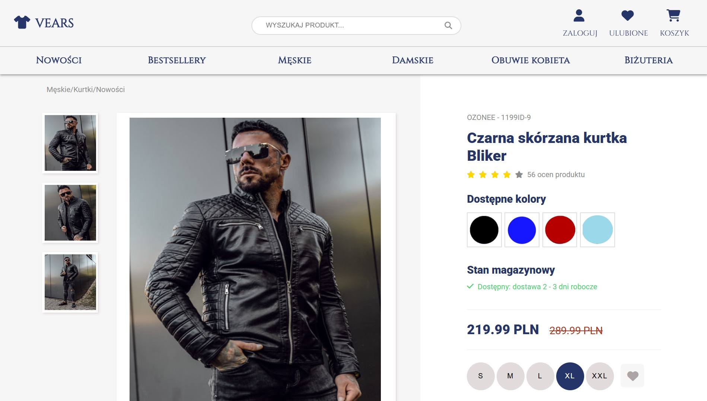;
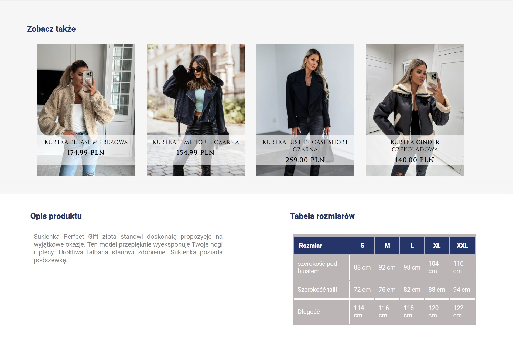;
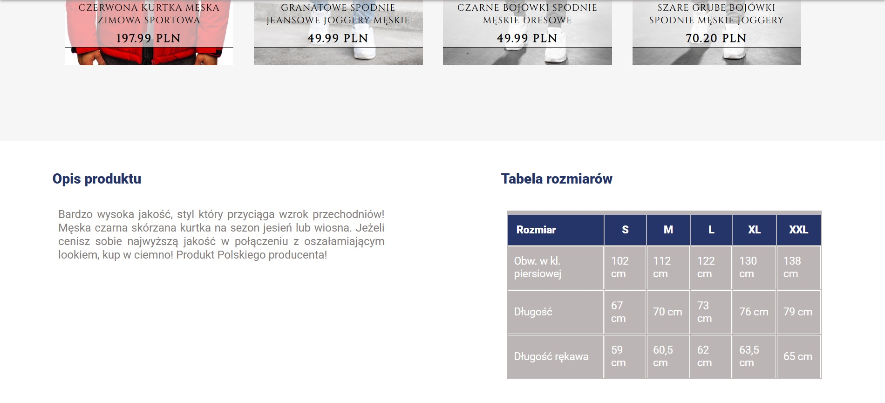;
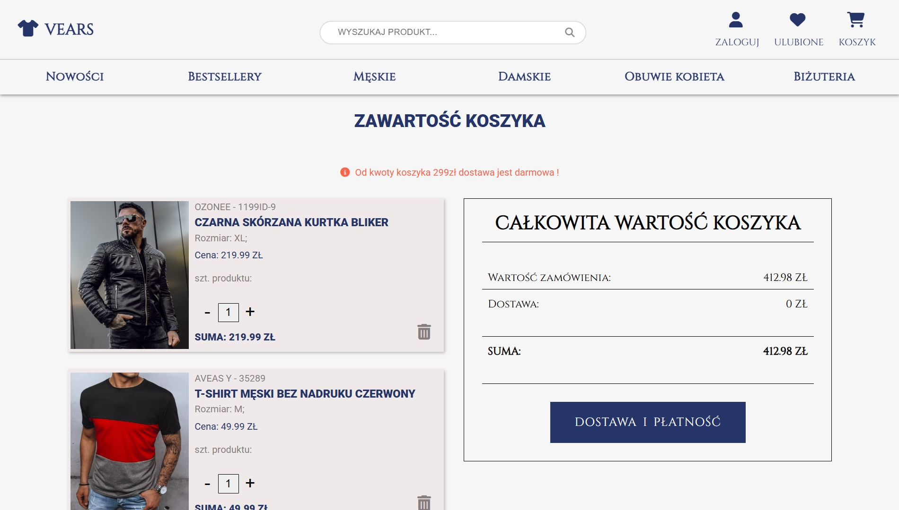;
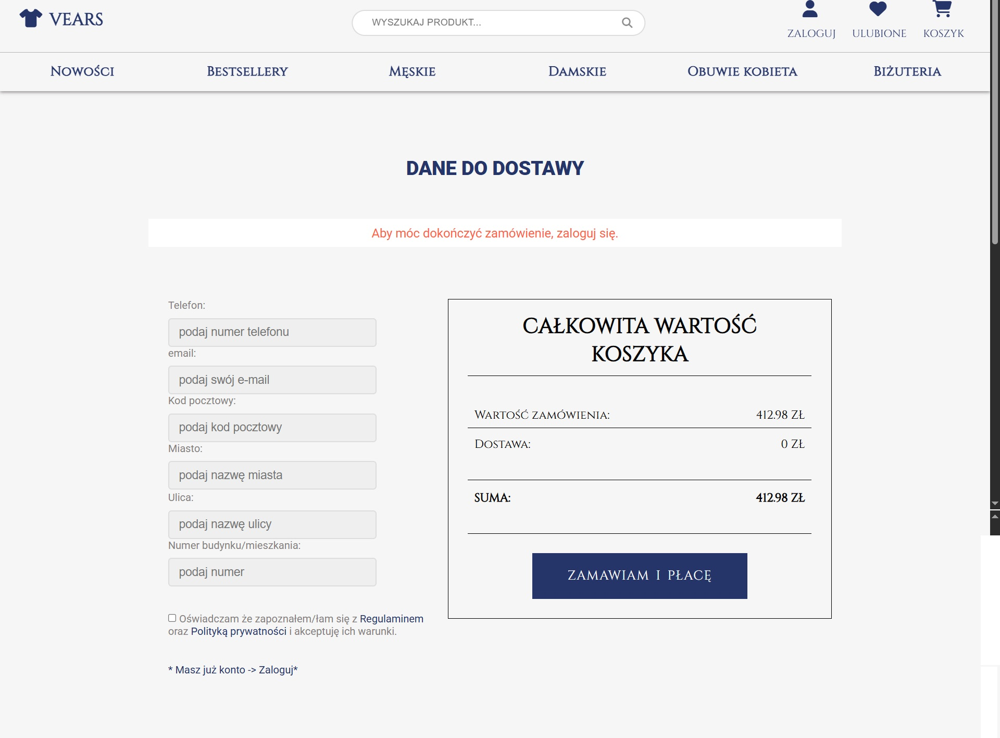;
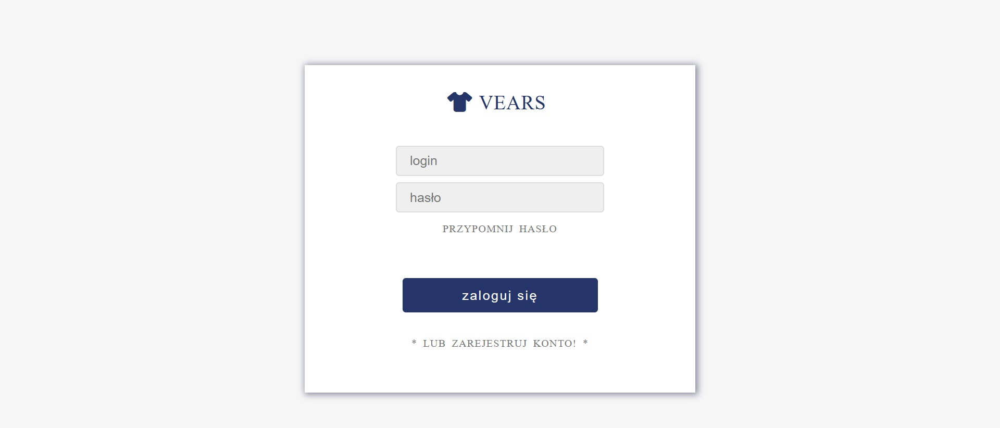;
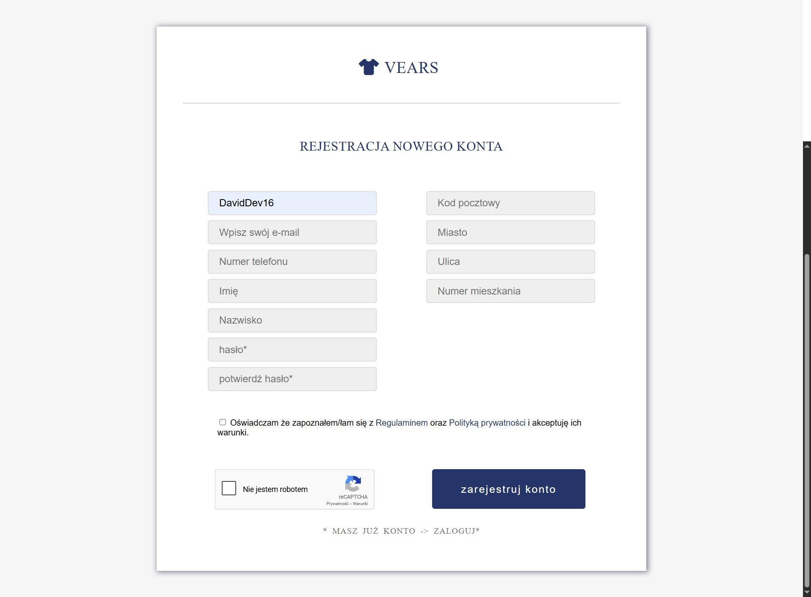;
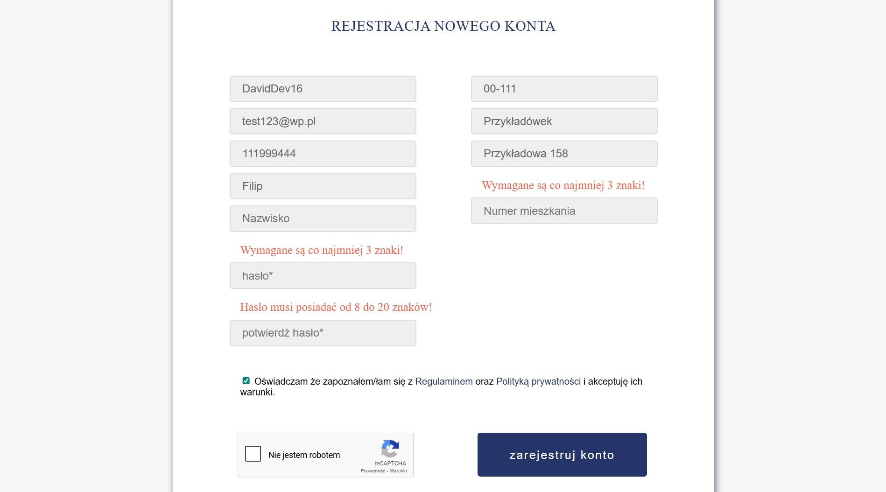;
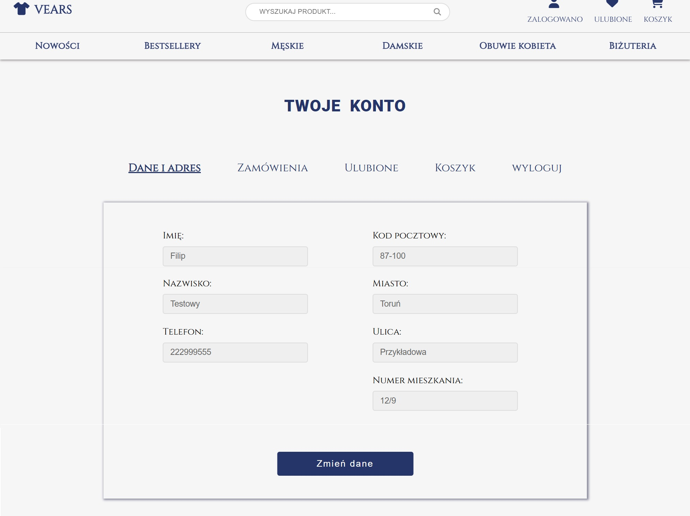;
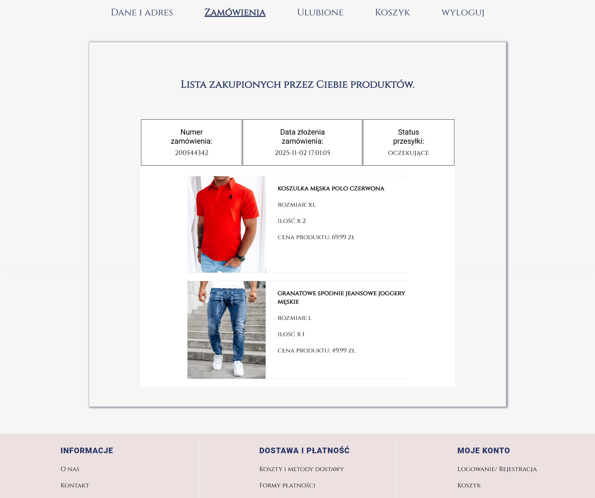;
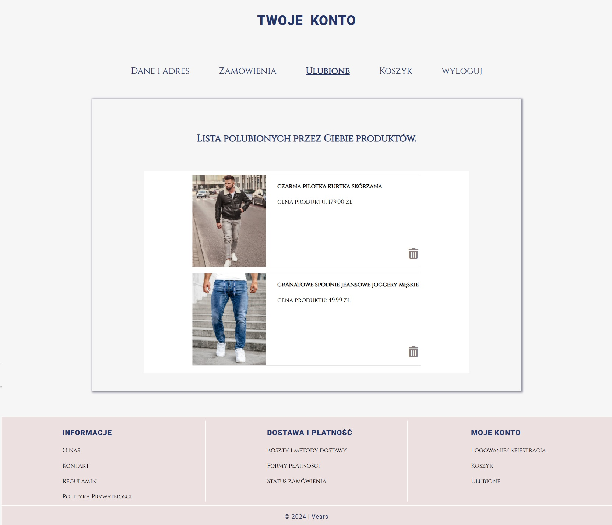;
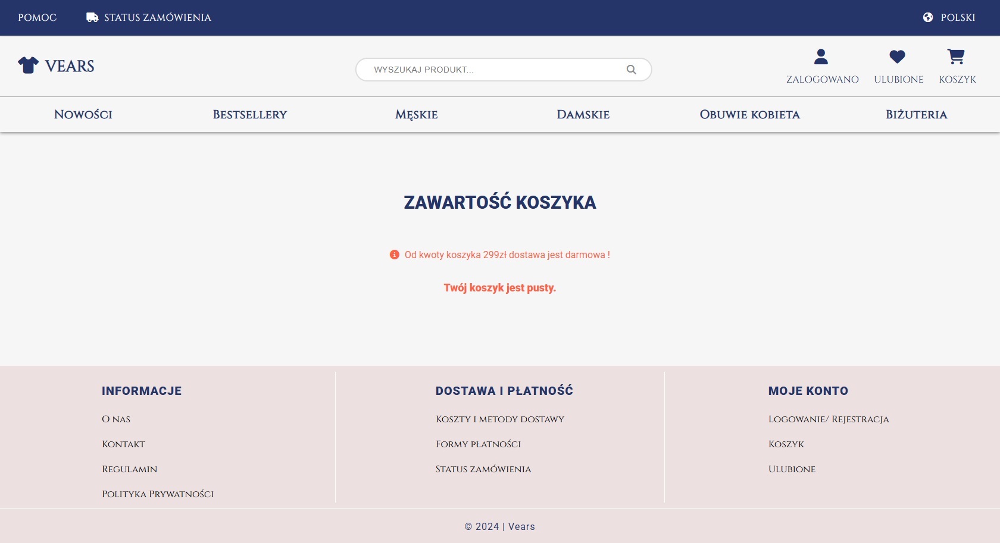;
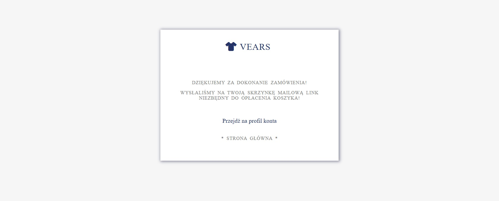;

## Installation

To run the project locally:

1. **Clone the repository**

   ```bash
   git clone https://github.com/WojciechSadowskiNwD/vears.git
   cd vears

   ```

2. **Place the project inside a local server environment**
   (e.g., XAMPP, WAMP, MAMP).
   Move the project folder into:

   ```bash
   htdocs/  -- XAMPP
   ```

3. **Create a MySQL database**

- Open phpMyAdmin
- Create a new database (e.g., vears_db)
- Import the SQL file shipped with the project:
  ```bash
  /database/vears.sql
  ```

4. **Configure database connection**

- In the file:
  ```bash
  /config/db.php
  ```
- update credentials:
  ```php
  $host = 'localhost';
  $user = 'root';
  $password = '';
  $database = 'vears_db';
  ```

5. **Start the local server**
- Enable Apache and MySQL in XAMPP/WAMP
- Access the project at:
   ```bash
   http://localhost/vears/
   ```

6. **Verify core features**
- Registration & login
- Product listing
- Product page
- Search engine
- Cart & favourites
- User profile


📄 License

This project is open source and licensed under the MIT License.
You are free to use, modify, and distribute it under the terms of this license.

Disclaimer (Assets Usage)

All product images used in this project come from various real online stores and are included solely for educational and non-commercial purposes.
All copyrights and trademarks belong to their respective owners.
If any owner requests removal of their assets, they will be removed immediately.